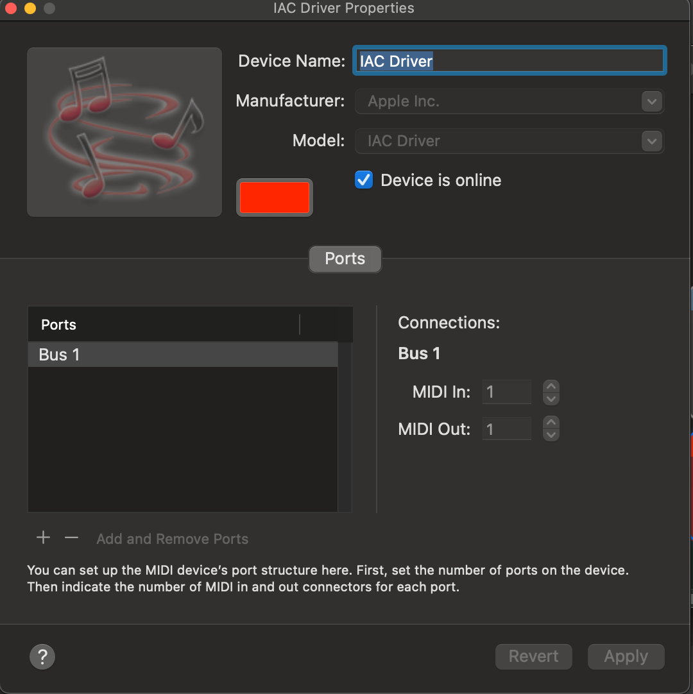
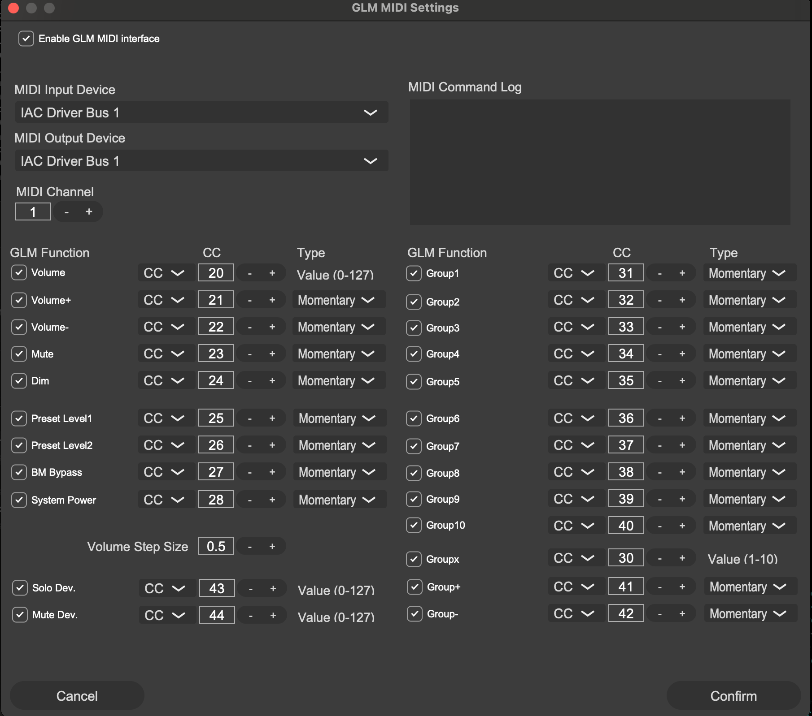

# glm cli

Genelec GLM cli (works over virtual MIDI, expects app to be open)

## Quick Install (No Clone)

Requires `uv`.

1. Install from GitHub:

   `uv tool install git+https://github.com/araa47/glm-cli`

2. Run from anywhere:

   `glm-cli --help`

To update later:

`uv tool upgrade glm-cli`

To remove:

`uv tool uninstall glm-cli`

## GLM App Setup

1. Open the Genelec GLM app

2. Open Audio Midi Setup -> Window show MIDI Studio -> Make sure IAC Driver is online. You can use the image below to verify.

3. Open Settings -> MIDI Settings on GLM app, make sure Enable GLM MIDI interface is checked, and the virtual MIDI device from the previous step is selected.

4. Run `glm-cli --help` to see available commands.

For one-off use (without installation), you can also run:

`uvx --from git+https://github.com/araa47/glm-cli glm-cli --help`

Equivalent command with `uv tool run`:

`uv tool run --from git+https://github.com/araa47/glm-cli glm-cli --help`

## Local Development Requirements

This assumes you have [direnv](https://direnv.net/) and [uv](https://github.com/astral-sh/uv) installed

Simply run `direnv allow` to setup the environment, you can read the contents of [.envrc](.envrc) to see what it does behind the scenes.

You should be able to run `glm-cli` from anywhere as the venv should be activated within the project.

## Code Quality

This project uses [prek](https://github.com/astral-sh/prek) as the hook runner (a faster pre-commit alternative), while keeping hooks defined in [.pre-commit-config.yaml](.pre-commit-config.yaml).

Run checks manually with:

- `uv run prek run --all-files`
- `uv run pytest`

# Releasing New Versions

1. `uv build`

2. `uv publish`

# ToDo

- [ ] Automate builds using github actions
