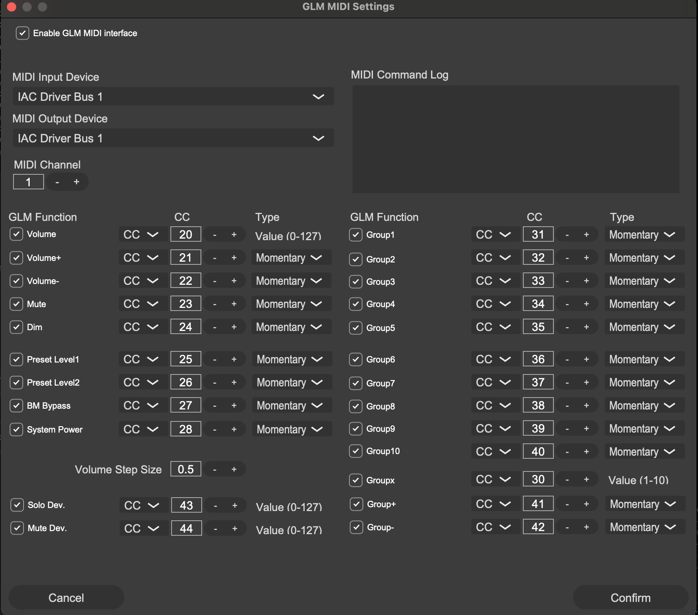

# glm cli

Genelec GLM cli (works over virtual midi, expects app to be open)

## Usage

1. Open the Genelec GLM app

2. Open Audio Midi Setup -> Window show Midi Studio -> Make sure IAC Driver is online, you can look at image below to verify

3. Open Settings -> Midi Settings on GLM app, make sure Enable GLM Midi interface is checkend, and the virtual midi device from the previous step is selected.

4. Run `uvx glm-cli` to see the available commands. This command allows using this cli without installing it. Alternatively you can install this via pip.

## Local Development Requirements

This assumes you have [direnv](https://direnv.net/) and [uv](https://github.com/astral-sh/uv) installed

Simply run `direnv allow` to setup the environment, you can read the contents of [.envrc](.envrc) to see what it does behind the scenes.

You should be able to run `glm-cli` from anywhere as the venv should be activated within the project.

# Releasing New Versions

1. `uvx build`

2. `twine upload dist/*`

# ToDo

- [ ] Automate builds using github actions
